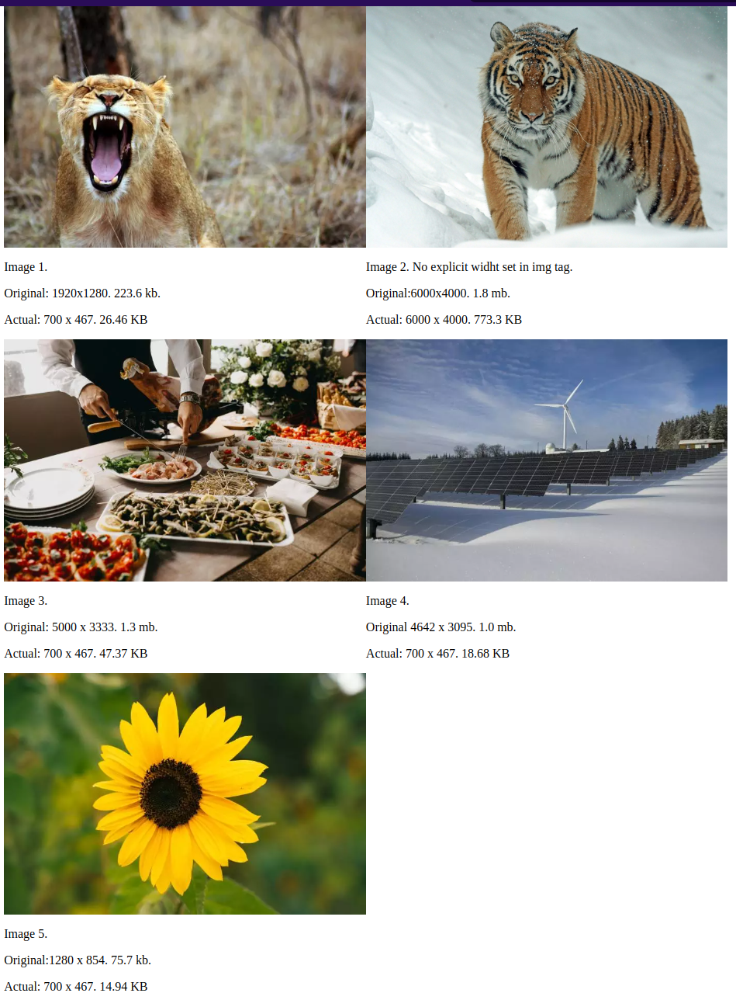

# Page to test mod_pagespeed image optimization

Basic page to test mod_pagespeed image optimization. The page contains a few images. It shows dimensions and size of the original images and the optimized images.

Images are from Pexels. 
Sample pagespeed.conf (for Apache) is included in the repository.

## Example
